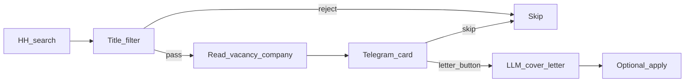

# hh-ai-agent-advance

Личный форк [fikstt2/hh-ai-agent](https://github.com/fikstt2/hh-ai-agent):  
https://github.com/google-dad/hh-ai-agent-advance

Бот обходит выдачу HH.ru, отсекает мусор по заголовку, открывает карточку в браузере и кидает превью в Telegram. Дальше решаете вы: генерировать письмо, править, откликаться или пропускать.

## Чем это не апстрим

В оригинале на **каждую** вакансию вызывается LLM: «подходит / не подходит» плюс сразу сопроводительное. Здесь цикл поиска **не** ходит в модель.



Поиск → локальный фильтр заголовка → страница HH → Telegram.  
LLM включается **только** после кнопки «Сгенерировать письмо».

### Зачем так (токены)

Автооценка каждой вакансии на reasoning-моделях (Together `gpt-oss` и аналоги) сжигает бюджет: длинное описание + профиль + внутренние reasoning-токены — часто впустую. По заголовку и так видно «мимо», а интересные карточки вы всё равно смотрите глазами.

Итог: фильтр и просмотр бесплатны; токены уходят только на письма, которые вы сами запросили.

## Запуск

```powershell
cd path\to\hh-ai-agent-advance
py -3.12 -m venv .venv
.\.venv\Scripts\activate
pip install -r requirements.txt
python setup_wizard.py
python main.py --check-config
python main.py --check-llm
python main.py
```

Wizard пишет локальные `.env` и `profile.yaml` (в Git их нет). Правки позже: `python setup_wizard.py --edit` или руками в YAML.

Нужны: Python 3.11+, Telegram-бот + ваш User ID, браузер (CloakBrowser или `BROWSER_BACKEND=playwright`). LLM — если нужны письма / `/keys` / `--check-llm`.

| Режим | Смысл |
|---|---|
| `dry_run` | Карточки без кнопок отклика |
| `approval` | Можно генерировать письмо и откликаться |

Реальный отклик только при `APP_MODE=approval` + `ENABLE_REAL_APPLY=true` + кнопка вашим Telegram ID.

## profile.yaml — что писать

Файл создаётся wizard’ом или копированием из [`profile.example.yaml`](profile.example.yaml). Личный профиль в репозиторий не коммитится.

### `candidate` — кто вы (в основном для текста письма)

| Поле | Нужно? | За что |
|---|---|---|
| `name` | **да** | Имя в промпте письма |
| `location` | нет | Город / «удалённо» — в письме |
| `desired_positions` | **да**, список ≠ `[]` | Целевые роли для промпта. Это **не** поисковые строки HH |
| `experience_summary` | **да** | Краткое резюме опыта — главный блок фактов для LLM |
| `education` | нет | Образование |
| `technologies` | нет | Навыки / инструменты |
| `projects` | нет | Кейсы и проекты |
| `github_url` | нет | Единственный URL, который можно оставить в письме (остальные ссылки режутся) |
| `salary_expectation` | нет | Ожидания по ЗП — модель может упомянуть в финале письма |
| `work_format` | нет | В промпт. Если есть `удалённо` или `remote` — в поиск HH добавляется `schedule=remote` |
| `excluded_positions` | нет | Доп. стоп-слова в **заголовке** вакансии (плюс встроенный фильтр) |
| `additional_information` | нет | Свободный текст: занятость, приоритеты, сайт и т.п. |

### `hh` — поиск и отклик

| Поле | Нужно? | За что |
|---|---|---|
| `resume_name` | **да** | Точное имя резюме в выпадающем списке HH при отклике |
| `search_queries` | **да** | Запросы поиска; агент проходит по каждому |
| `areas` | нет | ID регионов HH: `1` Москва, `2` СПб. Пустой `[]` — без геофильтра. Не пишите «Москва» текстом |
| `experience_filters` | нет | Коды HH: `noExperience`, `between1And3`, `between3And6`, `moreThan6`. `[]` — любой опыт |

### `cover_letter`

| Поле | Нужно? | За что |
|---|---|---|
| `language` | нет | Язык письма (`ru` по умолчанию) |
| `max_length` | нет | Лимит символов (дефолт 1800; у HH поле до ~10 000). При превышении — обрезка по концу предложения |
| `style` | нет | Тон промпта, например `professional` |

Глубина цикла задаётся в `.env`: `CHECK_INTERVAL_MINUTES`, `MAX_PAGES_PER_QUERY`, `MAX_VACANCIES_PER_QUERY`.

## Telegram

В `approval` на карточке без письма: **Сгенерировать письмо** / **Пропустить**.  
После генерации: **Откликнуться** / **Пропустить** / **Изменить письмо**.

Команды: `/start`, `/status`, `/pause`, `/resume`, `/pending`, `/stats`, `/diagnostics`, `/keys` (алиас `/mistral_keys`), `/cancel`.

## Модель — только письма

На отбор в цикле поиска LLM не влияет.

- **Ollama** — локально, без `/keys`
- **Mistral** — ключ + `LLM_KEYS_MASTER_KEY`, пул через `/keys`
- **OpenAI-compatible** (Together, Groq, …) — тот же пул `/keys`

Пример Together:

```ini
LLM_PROVIDER=openai_compatible
LLM_MODEL=openai/gpt-oss-120b
OPENAI_COMPATIBLE_BASE_URL=https://api.together.xyz/v1
OPENAI_COMPATIBLE_API_KEY=your_key
LLM_KEYS_MASTER_KEY=your_fernet_master_key
LLM_TIMEOUT_SECONDS=90
LLM_MAX_OUTPUT_TOKENS=4000
```

Для reasoning держите `LLM_MAX_OUTPUT_TOKENS` с запасом (≈3500–4000). Healthcheck (`--check-llm`) — до 256 токенов.

## Если что-то не так

- Нет карточек → смотрите логи: фильтр заголовка (`no-role`, стоп-слова), дубли в SQLite, `/pause`, circuit breaker.
- Нужен логин HH → `BROWSER_HEADLESS=false`, войти вручную.
- Пустое письмо → ключ/квота/эндпоинт; увеличьте `LLM_MAX_OUTPUT_TOKENS`.
- Хотите «с нуля» историю → остановите агент, сделайте backup `agent.db`, удалите/переименуйте файл.

Диагностика браузера/LLM вручную: `python -m scripts.browser_smoke`, `python -m scripts.llm_smoke`.

Тесты: `pytest -q` (без HH / Telegram / внешних LLM).

## Правовое

Автоматизация HH.ru может нарушать правила сервиса — риск на вас. Форк не обещает обход детекта и CAPTCHA. Массового авто-отклика нет.

Основа: [fikstt2/hh-ai-agent](https://github.com/fikstt2/hh-ai-agent). Архитектура approval — [kkonstantin08](https://github.com/kkonstantin08); валидация конфига — [danscMax](https://github.com/danscMax). Апстрим: @fikstt3.
